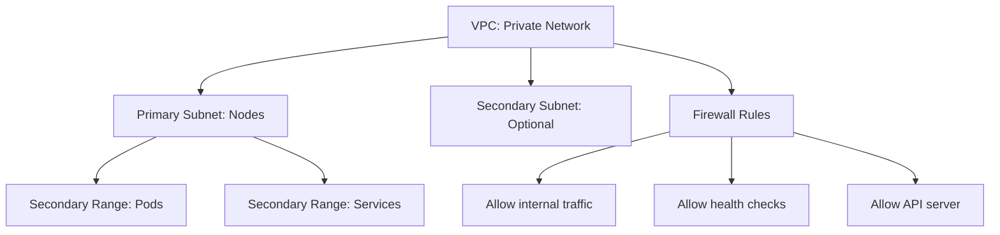

# Networking Module

This module manages GCP networking resources for the data-project-example, including:

- Private VPC for Kubernetes cluster
- Subnets with secondary IP ranges for pods and services
- Static IP addresses for subdomains
- (Optional) DNS records for the static IPs

## Architecture

The following diagram shows the VPC and subnet architecture for the Kubernetes cluster:



## Usage

```hcl
module "networking" {
  source = "./infrastructure/networking"
  
  project = "my-project"
  region  = "us-central1"
  
  # VPC Configuration
  vpc_name = "my-k8s-vpc"
  
  # Subnet Configuration
  subnets = [
    {
      name          = "k8s-subnet"
      ip_cidr_range = "10.0.0.0/20"
      region        = "us-central1"
      secondary_ip_ranges = {
        pods     = "10.16.0.0/12"
        services = "10.32.0.0/16"
      }
    }
  ]
}
```

## Inputs

| Name | Description | Type | Default | Required |
|------|-------------|------|---------|:--------:|
| project | GCP project to deploy resources within | `string` | `"data-project-example"` | no |
| region | GCP region to deploy resources within | `string` | `"us-central1"` | no |
| vpc_name | Name of the VPC to create | `string` | `"k8s-vpc"` | no |
| subnets | List of subnet configurations | `list(object)` | See variables.tf | no |
| subdomains | List of subdomain configurations | `list(object)` | See variables.tf | no |

## Outputs

| Name | Description |
|------|-------------|
| vpc_id | The ID of the VPC |
| vpc_self_link | The self-link of the VPC |
| subnet_ids | Map of subnet names to their IDs |
| subnet_self_links | Map of subnet names to their self-links |
| static_ip_details | Map of static IP names to their details |
