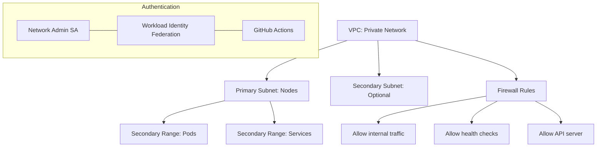

# Networking Module

This module manages GCP networking resources for the data-project-example, including:

- Private VPC for Kubernetes cluster
- Subnets with secondary IP ranges for pods and services
- Static IP addresses for subdomains
- (Optional) DNS records for the static IPs
- Service account with appropriate IAM roles for network administration
- Workload Identity Federation for secure GitHub Actions authentication

## Architecture

The following diagram shows the VPC and subnet architecture for the Kubernetes cluster:



## Usage

```hcl
module "networking" {
  source = "./infrastructure/networking"
  
  project = "my-project"
  region  = "us-central1"
  
  # VPC Configuration
  vpc_name = "my-k8s-vpc"
  
  # Subnet Configuration
  subnets = [
    {
      name          = "k8s-subnet"
      ip_cidr_range = "10.0.0.0/20"
      region        = "us-central1"
      secondary_ip_ranges = {
        pods     = "10.16.0.0/12"
        services = "10.32.0.0/16"
      }
    }
  ]
  
  # GitHub Workload Identity Federation
  project_id_prefix = "myproj"
  github_username = "your-github-username"  # For personal GitHub account
}
```

## Inputs

| Name | Description | Type | Default | Required |
|------|-------------|------|---------|:--------:|
| project | GCP project to deploy resources within | `string` | `"data-project-example"` | no |
| region | GCP region to deploy resources within | `string` | `"us-central1"` | no |
| vpc_name | Name of the VPC to create | `string` | `"k8s-vpc"` | no |
| subnets | List of subnet configurations | `list(object)` | See variables.tf | no |
| subdomains | List of subdomain configurations | `list(object)` | See variables.tf | no |
| project_id_prefix | Prefix for the Workload Identity Pool ID | `string` | `"dataproj"` | no |
| github_username | GitHub username that owns the repository | `string` | `"jolfr"` | no |

## Outputs

| Name | Description | Sensitive | Reason |
|------|-------------|:---------:|--------|
| vpc | The VPC resource details | Yes | Contains network identifiers that could be used in attacks |
| subnet_ids | Map of subnet names to their IDs | Yes | Contains network identifiers that could be used in attacks |
| subnet_self_links | Map of subnet names to their self-links | Yes | Contains network identifiers that could be used in attacks |
| static_ip_details | Map of static IP names to their details | Yes | Contains IP addresses that could be targeted |
| workload_identity_provider | The full resource name of the Workload Identity Provider | Yes | Contains project numbers and authentication details |
| network_service_account_email | The email of the service account | Yes | Could be used for impersonation attacks |
| workload_identity_pool_name | The name of the Workload Identity Pool | Yes | Security through obscurity |
| workload_identity_provider_display_name | The display name of the Workload Identity Provider | Yes | Security through obscurity |
| network_service_account_name | The name of the service account | Yes | Security through obscurity |

## Terraform State Management

This module uses Terraform Cloud for state management. The state is stored in the `data-project-example-networking` workspace within the `jolfr-personal` organization, as configured in `terraform.tf`:

```hcl
terraform {
  cloud {
    organization = "jolfr-personal"

    workspaces {
      name = "data-project-example-networking"
    }
  }
}
```

This ensures:
- Secure storage of state files
- State locking to prevent concurrent modifications
- Version history of infrastructure changes
- Team collaboration capabilities

## GitHub Actions Integration

This module is designed to work with the existing GitHub Actions workflows in the repository. The workflows automatically plan and apply Terraform changes when code is pushed to the repository.

### Workflow Structure

1. **Pull Request Workflow** (`pull-request.yml`):
   - Triggered on pull requests to the main branch
   - Runs `terraform plan` to preview changes
   - Comments the plan results on the PR

2. **Main Branch Workflow** (`main.yml`):
   - Triggered on pushes to the main branch
   - Creates a release with changelog
   - Runs `terraform apply` to implement changes

3. **Terraform Module Management** (`terraform.yml`):
   - Detects changes in Terraform files
   - Calls the appropriate plan or apply workflow

### Sensitive Output Handling

Outputs marked as `sensitive = true` are handled securely:

- They are stored in Terraform state but not displayed in logs
- GitHub Actions will show `(sensitive value)` instead of the actual value
- You can retrieve sensitive values manually using `terraform output -json` locally

Example from GitHub Actions logs:
```
Outputs:

network_service_account_email = <sensitive>
subnet_ids = <sensitive>
vpc = <sensitive>
workload_identity_provider = <sensitive>
```

## Workload Identity Federation Bootstrapping

Since there's a chicken-and-egg problem (you need Workload Identity to deploy, but you need to deploy to create Workload Identity), follow this bootstrapping process:

### Initial Setup (One-time Process)

1. **Initial Deployment**:
   ```bash
   # Authenticate with your personal account
   gcloud auth application-default login
   
   # Navigate to the networking module
   cd infrastructure/networking
   
   # Initialize and apply
   terraform init
   terraform apply
   ```

2. **Get the Sensitive Outputs**:
   ```bash
   # Get the Workload Identity Provider name
   PROVIDER=$(terraform output -raw workload_identity_provider)
   
   # Get the Service Account email
   SA_EMAIL=$(terraform output -raw network_service_account_email)
   ```

3. **Add GitHub Repository Secrets**:
   - Go to your GitHub repository → Settings → Secrets and variables → Actions
   - Add the following secrets:
     - `WORKLOAD_IDENTITY_PROVIDER`: The value of `$PROVIDER`
     - `GCP_SERVICE_ACCOUNT`: The value of `$SA_EMAIL`

4. **Update GitHub Workflows**:
   - Add the authentication steps to your workflow files:

   ```yaml
   - name: Authenticate to Google Cloud
     id: auth
     uses: google-github-actions/auth@v1
     with:
       workload_identity_provider: ${{ secrets.WORKLOAD_IDENTITY_PROVIDER }}
       service_account: ${{ secrets.GCP_SERVICE_ACCOUNT }}

   - name: Set up Cloud SDK
     uses: google-github-actions/setup-gcloud@v1
   ```

### Using as a Personal GitHub User

This module is configured to work with personal GitHub accounts:

1. The `github_username` variable specifies your personal GitHub username
2. The IAM binding uses this format: `username/repository`
3. The Workload Identity Federation provider is configured for GitHub's OIDC token format

## Security Considerations

1. **No Service Account Keys**: This implementation uses Workload Identity Federation instead of service account keys, eliminating key management risks.

2. **Least Privilege**: The service account has only the necessary networking permissions.

3. **Repository Restriction**: Only the specified GitHub repository can impersonate the service account.

4. **Sensitive Outputs**: All outputs containing potentially sensitive information are marked as sensitive to prevent exposure in logs.

5. **Audit Trail**: All service account impersonation is logged in Cloud Audit Logs.

6. **API Server Access**: Consider restricting the default `api_server_cidr` from `0.0.0.0/0` to your organization's IP ranges.
