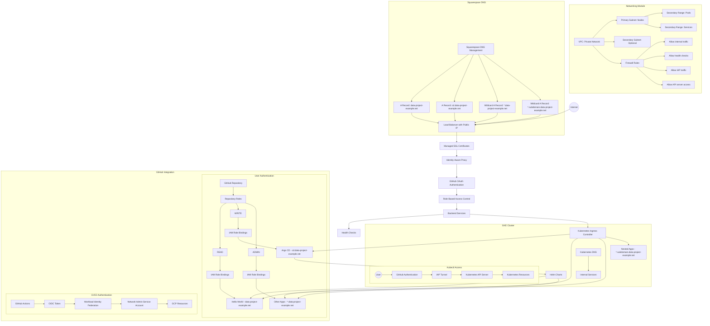

# Networking Module

## Table of Contents
- [Overview](#overview)
- [Purpose](#purpose)
- [Architecture](#architecture)
- [Network Resource Classification](#network-resource-classification)
  - [Machine-Only Resources](#machine-only-resources)
  - [User-Facing Resources](#user-facing-resources)
- [Usage](#usage)
- [Required Variables](#required-variables)
  - [GitHub OAuth Setup](#github-oauth-setup)
- [Inputs](#inputs)
- [Outputs](#outputs)
- [Terraform Cloud Setup](#terraform-cloud-setup)
  - [Setting Up Variables in Terraform Cloud](#setting-up-variables-in-terraform-cloud)
- [GitHub Actions Integration](#github-actions-integration)
  - [Workflow Structure](#workflow-structure)
  - [Sensitive Output Handling](#sensitive-output-handling)
- [Bootstrapping Process](#bootstrapping-process)
  - [One-Time Setup Steps](#one-time-setup-steps)
  - [Per-Application Setup Steps](#per-application-setup-steps)
- [ArgoCD Integration](#argocd-integration)
- [Hello World Application](#hello-world-application)
- [Kubectl Access Setup](#kubectl-access-setup)
  - [Setting Up Kubectl Access with GitHub Authentication](#setting-up-kubectl-access-with-github-authentication)
  - [Access Levels Based on GitHub Repository Roles](#access-levels-based-on-github-repository-roles)
- [Security Considerations](#security-considerations)
- [Required IAM Policies for Terraform Service Account](#required-iam-policies-for-terraform-service-account)
  - [Applying These Policies](#applying-these-policies)
  - [Security Considerations](#security-considerations-1)
- [License](#license)

## Overview

This module manages GCP networking resources for the data-project-example, including:

- Private VPC for Kubernetes cluster
- Subnets with secondary IP ranges for pods and services
- Static IP addresses for subdomains
- (Optional) DNS records for the static IPs
- Service account with appropriate IAM roles for network administration
- Workload Identity Federation for secure GitHub Actions authentication
- GitHub authentication for Helm-deployed applications and kubectl access
- Integration with Squarespace DNS for public domain management

## Purpose

This networking module is part of a personal open-source project released under the MIT License. It's designed to provide a secure and scalable networking infrastructure for Kubernetes applications with GitHub-based authentication, making it easy for individual developers to:

- Deploy applications with proper network isolation
- Authenticate users based on their GitHub repository roles
- Provide secure kubectl access to the cluster
- Manage DNS records for applications

## Architecture

The following diagram shows the enhanced architecture with GitHub authentication:



## Network Resource Classification

This module manages two distinct types of network resources:

### Machine-Only Resources

These resources are used exclusively by the infrastructure and are not directly exposed to users:

- VPC and subnets (internal infrastructure)
- Pod and service IP ranges
- Internal cluster DNS
- Firewall rules for internal communication
- Workload Identity Federation for CI/CD

### User-Facing Resources

These resources are exposed to users and require authentication:

- External static IPs for application access
- IAP configuration for authentication
- Load balancers and ingress controllers
- DNS configuration for public access

## Usage

```hcl
module "networking" {
  source = "./infrastructure/networking"
  
  project = "my-project"
  region  = "us-central1"
  
  # VPC Configuration
  vpc_name = "my-k8s-vpc"
  
  # Subnet Configuration
  subnets = [
    {
      name          = "k8s-subnet"
      ip_cidr_range = "10.0.0.0/20"
      region        = "us-central1"
      secondary_ip_ranges = {
        pods     = "10.16.0.0/12"
        services = "10.32.0.0/16"
      }
    }
  ]
  
  # Static IP Configuration
  subdomains = [
    {
      name = "root",
      address_type = "EXTERNAL",
      network_tier = "PREMIUM"
    },
    {
      name = "cd",
      address_type = "EXTERNAL",
      network_tier = "PREMIUM"
    }
  ]
  
  # GitHub Authentication
  github_oauth_client_id     = "your-github-oauth-client-id"
  github_oauth_client_secret = "your-github-oauth-client-secret"
  
  # GitHub Workload Identity Federation
  project_id_prefix = "myproj"
  github_username = "your-github-username"  # For personal GitHub account
}
```

## Inputs

| Name | Description | Type | Default | Required |
|------|-------------|------|---------|:--------:|
| project | GCP project to deploy resources within | `string` | n/a | yes |
| region | GCP region to deploy resources within | `string` | `"us-central1"` | no |
| vpc_name | Name of the VPC to create | `string` | `"k8s-vpc"` | no |
| subnets | List of subnet configurations | `list(object)` | See variables.tf | no |
| subdomains | List of subdomain configurations | `list(object)` | See variables.tf | no |
| project_id_prefix | Prefix for the Workload Identity Pool ID | `string` | `"dataproj"` | no |
| github_username | GitHub username that owns the repository | `string` | `"jolfr"` | no |

## Outputs

| Name | Description | Sensitive | Reason |
|------|-------------|:---------:|--------|
| vpc | The VPC resource details | Yes | Contains network identifiers that could be used in attacks |
| subnet_ids | Map of subnet names to their IDs | Yes | Contains network identifiers that could be used in attacks |
| subnet_self_links | Map of subnet names to their self-links | Yes | Contains network identifiers that could be used in attacks |
| static_ip_details | Map of static IP names to their details | Yes | Contains IP addresses that could be targeted |
| workload_identity_provider | The full resource name of the Workload Identity Provider | Yes | Contains project numbers and authentication details |
| network_service_account_email | The email of the service account | Yes | Could be used for impersonation attacks |
| workload_identity_pool_name | The name of the Workload Identity Pool | Yes | Security through obscurity |
| workload_identity_provider_display_name | The display name of the Workload Identity Provider | Yes | Security through obscurity |
| network_service_account_name | The name of the service account | Yes | Security through obscurity |

## Required Variables

This module requires several variables to be set before it can be applied. The most important required variables are:

| Name | Description | How to Obtain |
|------|-------------|--------------|
| `github_oauth_client_id` | GitHub OAuth client ID for IAP authentication | See [GitHub OAuth Setup](#github-oauth-setup) below |
| `github_oauth_client_secret` | GitHub OAuth client secret for IAP authentication | See [GitHub OAuth Setup](#github-oauth-setup) below |
| `project` | GCP project ID to deploy resources within | From your Google Cloud Console |
| `github_username` | GitHub username that owns the repository | Your GitHub username |

## Organization IAP Access

This module now supports Identity-Aware Proxy (IAP) access for GitHub organization repositories. The following changes have been implemented:

- IAP is now enabled by default for projects that are part of a GCP organization
- GitHub organization OAuth integration for authentication
- Role-based access control based on GitHub repository roles:
  - READ access to the repository grants access to the root domain (data-project-example.net)
  - WRITE access grants additional permissions for managing applications
  - ADMIN access provides full administrative control

### GitHub Organization OAuth Setup

To obtain the GitHub OAuth credentials needed for IAP authentication with a GitHub organization:

1. Go to your GitHub organization → Settings → Developer settings → OAuth Apps
2. Click "New OAuth App"
3. Fill in the following details:
   - **Application name**: `example-org`
   - **Homepage URL**: `https://data-project-example.net`
   - **Authorization callback URL**: `https://iap.googleapis.com/v1/oauth/clientIds/YOUR_CLIENT_ID:handleRedirect`
     - Note: You'll need to update this URL after creating the OAuth app and getting the client ID
4. Click "Register application"
5. You'll receive a Client ID immediately
6. Click "Generate a new client secret" to get your Client Secret
7. Save both the Client ID and Client Secret for use in Terraform Cloud
8. Configure organization permissions:
   - Go to the OAuth App settings
   - Under "Organization access", grant access to your organization
   - Set appropriate permission scopes based on your requirements
9. For production deployments, consider:
   - Verifying the domain associated with your organization
   - Setting up IP allowlists for added security
   - Configuring SAML SSO integration if your organization uses it

**Important Note on Authentication**: Even though the Google OAuth consent screen is set to "Internal", users do NOT need to have your organization email to use the service. Authentication is handled by GitHub, not Google. Users authenticate with their GitHub accounts, and access is controlled by GitHub repository roles (READ, WRITE, ADMIN). The "Internal" setting only affects the Google OAuth brand configuration and allows you to avoid the verification process.

### Access Control

Access to applications is controlled based on GitHub repository roles:

| GitHub Role | Access Level | Resources |
|-------------|--------------|-----------|
| READ        | Basic access | Root domain (data-project-example.net) |
| WRITE       | Advanced access | ArgoCD (cd.data-project-example.net) |
| ADMIN       | Full access | All resources |

For more detailed configuration options, see the [GitHub Organization OAuth Setup](#github-organization-oauth-setup) section.

### Manual IAP Brand Creation

In some cases, you may encounter a permission error when Terraform attempts to create an IAP brand:

```
Error: Error creating Brand: googleapi: Error 403: The caller does not have permission
```

This occurs because creating IAP brands requires specific permissions that are often restricted to user accounts rather than service accounts. To resolve this issue:

1. **Create the IAP Brand Manually**:
   - Go to the Google Cloud Console: https://console.cloud.google.com/
   - Navigate to **Security > Identity-Aware Proxy**
   - Select your project
   - You'll be prompted to configure the OAuth consent screen:
     - **Application name**: "Data Project Example" (or your preferred name)
     - **Support email**: Your email address
     - **Application homepage**: Optional, can be left blank
   - Click **Save** to create the brand

2. **Get the Brand Name**:
   - After creating the brand, look at the URL in your browser
   - The URL will contain something like `brand=brands%2FBRAND_ID`
   - The full brand name will be in the format `projects/PROJECT_NUMBER/brands/BRAND_ID`
   - Alternatively, use the gcloud CLI:
     ```bash
     gcloud iap oauth-brands list --project=YOUR_PROJECT_ID
     ```

3. **Update Terraform Configuration**:
   - Set the `existing_iap_brand` variable with the brand name you obtained
   - This variable is required and must be in the format `projects/PROJECT_NUMBER/brands/BRAND_ID`

This approach allows Terraform to use the manually created brand instead of attempting to create a new one.

## Terraform Cloud Setup

This module uses Terraform Cloud for state management. The state is stored in the `data-project-example-networking` workspace within your personal Terraform Cloud account, as configured in `terraform.tf`:

```hcl
terraform {
  cloud {
    organization = "jolfr-personal"

    workspaces {
      name = "data-project-example-networking"
    }
  }
}
```

This ensures:
- Secure storage of state files
- State locking to prevent concurrent modifications
- Version history of infrastructure changes
- Ability to share with collaborators if needed

### Setting Up Variables in Terraform Cloud

Before running `terraform plan` or `terraform apply`, you need to set up the required variables in Terraform Cloud:

1. Log in to [Terraform Cloud](https://app.terraform.io/)
2. Navigate to your organization → `data-project-example-networking` workspace
3. Go to "Variables" tab
4. Add the following variables:

| Key | Category | Sensitive | Description |
|-----|----------|-----------|-------------|
| `github_oauth_client_id` | Terraform | Yes | GitHub OAuth client ID from the setup above |
| `github_oauth_client_secret` | Terraform | Yes | GitHub OAuth client secret from the setup above |
| `project` | Terraform | No | Your GCP project ID |
| `github_username` | Terraform | No | Your GitHub username |

5. Save the variables
6. Now you can run `terraform plan` and `terraform apply` from your local machine, and Terraform Cloud will use these variables

## GitHub Actions Integration

This module is designed to work with GitHub Actions workflows. The workflows automatically plan and apply Terraform changes when code is pushed to the repository.

### Workflow Structure

1. **Pull Request Workflow** (`pull-request.yml`):
   - Triggered on pull requests to the main branch
   - Runs `terraform plan` to preview changes
   - Comments the plan results on the PR

2. **Main Branch Workflow** (`main.yml`):
   - Triggered on pushes to the main branch
   - Creates a release with changelog
   - Runs `terraform apply` to implement changes

3. **Terraform Module Management** (`terraform.yml`):
   - Detects changes in Terraform files
   - Calls the appropriate plan or apply workflow

### Sensitive Output Handling

Outputs marked as `sensitive = true` are handled securely:

- They are stored in Terraform state but not displayed in logs
- GitHub Actions will show `(sensitive value)` instead of the actual value
- You can retrieve sensitive values manually using `terraform output -json` locally

Example from GitHub Actions logs:
```
Outputs:

network_service_account_email = <sensitive>
subnet_ids = <sensitive>
vpc = <sensitive>
workload_identity_provider = <sensitive>
```

## Bootstrapping Process

### One-Time Setup Steps

1. **Set Up Terraform Cloud Variables**:
   - Log in to [Terraform Cloud](https://app.terraform.io/)
   - Navigate to your organization → `data-project-example-networking` workspace
   - Set up the required variables as described in [Setting Up Variables in Terraform Cloud](#setting-up-variables-in-terraform-cloud)

2. **Initial Deployment of Networking Infrastructure**:
   ```bash
   # Authenticate with your personal account
   gcloud auth application-default login
   
   # Navigate to the networking module
   cd infrastructure/networking
   
   # Initialize and apply
   terraform init
   terraform apply
   ```

2. **Get the Sensitive Outputs for CI/CD**:
   ```bash
   # Get the Workload Identity Provider name
   PROVIDER=$(terraform output -raw workload_identity_provider)
   
   # Get the Service Account email
   SA_EMAIL=$(terraform output -raw network_service_account_email)
   ```

3. **Add GitHub Repository Secrets for CI/CD**:
   - Go to your GitHub repository → Settings → Secrets and variables → Actions
   - Add the following secrets:
     - `WORKLOAD_IDENTITY_PROVIDER`: The value of `$PROVIDER`
     - `GCP_SERVICE_ACCOUNT`: The value of `$SA_EMAIL`

4. **Set Up GitHub OAuth Application**:
   - Go to your GitHub account → Settings → Developer settings → OAuth Apps
   - Create a new OAuth application with:
     - Application name: `data-project-example`
     - Homepage URL: `https://data-project-example.net`
     - Authorization callback URL: `https://iap.googleapis.com/v1/oauth/clientIds/YOUR_CLIENT_ID:handleRedirect`
   - Note the Client ID and Client Secret

5. **Configure IAP in Google Cloud Console**:
   - Go to Google Cloud Console → Security → Identity-Aware Proxy
   - Enable IAP for the backend services
   - Add members with appropriate roles based on GitHub repository roles

6. **Set Up Internal DNS for the Cluster**:
   - The GKE cluster automatically configures kube-dns or CoreDNS
   - For additional internal DNS zones, create a ConfigMap:
     ```yaml
     apiVersion: v1
     kind: ConfigMap
     metadata:
       name: coredns-custom
       namespace: kube-system
     data:
       internal-services.override: |
         internal.data-project-example.net {
           forward . 10.0.0.10
         }
     ```

7. **Configure Squarespace DNS**:
   - Retrieve static IPs from Terraform outputs:
     ```bash
     # Get the static IP for the root domain
     ROOT_IP=$(terraform output -raw static_ip_details | jq -r '.root.ip_address')
     
     # Get the static IP for the cd subdomain
     CD_IP=$(terraform output -raw static_ip_details | jq -r '.cd.ip_address')
     ```
   - Log in to your Squarespace account
   - Navigate to Settings → Domains → [Your Domain] → Advanced Settings → DNS Settings
   - Since you own the domain, you have two options for DNS configuration:
   
     **Option 1: Individual Records** (if you need different IPs for different subdomains):
     - A record: Host `@` → Points to `$ROOT_IP` (for root domain)
     - A record: Host `cd` → Points to `$CD_IP` (for cd subdomain)
     
     **Option 2: Wildcard Record** (if most subdomains share the same IP):
     - A record: Host `@` → Points to `$ROOT_IP` (for root domain)
     - A record: Host `cd` → Points to `$CD_IP` (for cd subdomain)
     - A record: Host `*` → Points to `$ROOT_IP` (covers all other subdomains)
     
     **Note**: With Squarespace DNS, you typically don't need to specify the full domain name in the Host field, just the subdomain part or `@` for the root domain.

### Per-Application Setup Steps

1. **Create Static IP for the Application** (if needed):
   - Add a new entry to the `subdomains` variable in `variables.tf`:
     ```hcl
     {
       name = "app-name",
       address_type = "EXTERNAL",
       network_tier = "PREMIUM"
     }
     ```
   - Apply the Terraform changes:
     ```bash
     terraform apply
     ```
   - Get the new IP address:
     ```bash
     APP_IP=$(terraform output -raw static_ip_details | jq -r '.app-name.ip_address')
     ```

2. **Configure DNS for the Application**:
   - Add an A record in Squarespace DNS:
     - Navigate to Settings → Domains → [Your Domain] → Advanced Settings → DNS Settings
     - Add A record: Host `app-name` → Points to `$APP_IP`
   - For nested subdomains:
     - Add A record: Host `app-name.subdomain` → Points to `$APP_IP`
   - Alternatively, if you're using a wildcard record (`*`), you may not need to add individual records for each new application

3. **Configure IAP Access for the Application**:
   - Go to Google Cloud Console → Security → Identity-Aware Proxy
   - Add the new backend service
   - Configure access levels based on GitHub repository roles:
     - READ: Basic access to view the application
     - WRITE: Advanced access to modify application settings
     - ADMIN: Full administrative access

4. **Create Kubernetes Ingress Resource**:
   - Define ingress rules for the application:
     ```yaml
     apiVersion: networking.k8s.io/v1
     kind: Ingress
     metadata:
       name: app-name-ingress
       annotations:
         kubernetes.io/ingress.class: "gce"
         kubernetes.io/ingress.global-static-ip-name: "data-project-example-app-name"
         networking.gke.io/v1beta1.FrontendConfig: "iap-config"
     spec:
       rules:
       - host: "app-name.data-project-example.net"
         http:
           paths:
           - path: "/"
             pathType: Prefix
             backend:
               service:
                 name: app-name-service
                 port:
                   number: 80
     ```

## ArgoCD Integration

ArgoCD is deployed as a special case with the following considerations:

1. **Dedicated Static IP**:
   - ArgoCD has a dedicated static IP at `cd.data-project-example.net`
   - This IP is EXTERNAL to allow user access

2. **GitHub Authentication**:
   - ArgoCD uses GitHub OAuth for authentication
   - Users with WRITE access to the repository can access ArgoCD

3. **RBAC Configuration**:
   - Repository roles are mapped to ArgoCD roles:
     - READ: read-only access to applications
     - WRITE: ability to sync applications
     - ADMIN: full administrative access

4. **Integration with Helm Applications**:
   - ArgoCD manages Helm-deployed applications
   - Applications are defined in the `infrastructure/charts/argo-cd/templates/` directory
   - The hello-world application is accessible at the root domain

## Hello World Application

The hello-world application defined in `infrastructure/charts/argo-cd/templates/hello-world.yaml` is:

1. **Deployed at Root Domain**:
   - Accessible at `data-project-example.net`
   - Requires GitHub READ access to view

2. **Managed by ArgoCD**:
   - Defined as an ArgoCD Application resource
   - Automatically synced from the GitHub repository

3. **Secured with IAP**:
   - Protected by Identity-Aware Proxy
   - Authenticated using GitHub OAuth
   - Access controlled based on repository roles

## Kubectl Access Setup

This section explains how to set up kubectl access to the GKE cluster using GitHub authentication.

### Setting Up Kubectl Access with GitHub Authentication

1. **Install the Google Cloud SDK and kubectl**:
   ```bash
   # Install Google Cloud SDK
   curl https://sdk.cloud.google.com | bash
   
   # Install kubectl
   gcloud components install kubectl
   ```

2. **Install the gke-gcloud-auth-plugin**:
   ```bash
   gcloud components install gke-gcloud-auth-plugin
   ```

3. **Get Cluster Credentials**:
   ```bash
   # Get the cluster credentials
   gcloud container clusters get-credentials data-project-example-cluster \
     --region=us-central1 \
     --project=data-project-example
   ```

4. **Configure IAP for API Server Access**:
   ```bash
   # Enable IAP for the Kubernetes API server
   gcloud compute firewall-rules create allow-iap-to-k8s \
     --direction=INGRESS \
     --action=ALLOW \
     --rules=tcp:443 \
     --source-ranges=35.235.240.0/20 \
     --target-tags=gke-data-project-example-cluster
   ```

5. **Configure kubectl to use IAP Tunnel**:
   ```bash
   # Create an IAP tunnel to the Kubernetes API server
   gcloud compute start-iap-tunnel \
     gke-data-project-example-cluster-master 443 \
     --local-host-port=localhost:8888 \
     --zone=us-central1-a
   
   # Update kubeconfig to use the tunnel
   kubectl config set-cluster data-project-example-cluster \
     --server=https://localhost:8888
   ```

6. **Authenticate with GitHub**:
   - When accessing the cluster through IAP, you'll be prompted to authenticate with GitHub
   - Your GitHub repository role will determine your access level in the cluster

### Access Levels Based on GitHub Repository Roles

1. **READ Access**:
   - Can view resources (pods, services, configmaps, secrets)
   - Cannot modify any resources
   - Ideal for developers who need to monitor but not change resources

2. **WRITE Access**:
   - Can view and modify basic resources (pods, services, configmaps)
   - Cannot modify sensitive resources (secrets, roles, cluster settings)
   - Suitable for developers who need to deploy and manage applications

3. **ADMIN Access**:
   - Full administrative access to all resources
   - Can modify cluster settings, roles, and sensitive resources
   - Reserved for project maintainers

## Security Considerations

1. **No Service Account Keys**: This implementation uses Workload Identity Federation instead of service account keys, eliminating key management risks.

2. **Least Privilege**: The service account has only the necessary networking permissions.

3. **Repository Restriction**: Only the specified GitHub repository can impersonate the service account.

4. **Sensitive Outputs**: All outputs containing potentially sensitive information are marked as sensitive to prevent exposure in logs.

5. **Audit Trail**: All service account impersonation is logged in Cloud Audit Logs.

6. **API Server Access**: Consider restricting the default `api_server_cidr` from `0.0.0.0/0` to your organization's IP ranges.

7. **GitHub Role-Based Access**: Access to applications is controlled based on GitHub repository roles:
   - READ: Basic access to view applications (e.g., hello-world)
   - WRITE: Advanced access to manage applications (e.g., ArgoCD)
   - ADMIN: Full administrative access to all applications

## Required IAM Policies for Terraform Service Account

The service account used to run `terraform apply` for this networking module requires the following IAM roles to successfully create and manage all resources:

| Role | Purpose | Resources Managed |
|------|---------|-------------------|
| `roles/iam.workloadIdentityPoolAdmin` | Create and manage Workload Identity Pools | Workload Identity Pools, providers |
| `roles/compute.networkAdmin` | Manage VPC networks and subnets | VPC, subnets, routes |
| `roles/compute.securityAdmin` | Manage firewall rules | Firewall rules, security policies |
| `roles/dns.admin` | Manage DNS records | DNS zones and records |
| `roles/iam.serviceAccountAdmin` | Create and manage service accounts | Service accounts |
| `roles/iam.securityAdmin` | Manage IAM policies | IAM bindings, policies |
| `roles/iap.admin` | Configure Identity-Aware Proxy | IAP brands, clients, settings |
| `roles/compute.loadBalancerAdmin` | Manage load balancers | Backend services, health checks, SSL certificates |
| `roles/serviceusage.serviceUsageAdmin` | Enable required APIs | Service enablement |

### Applying These Policies

To grant these roles to your service account:

```bash
# Replace with your project ID and service account email
PROJECT_ID="your-project-id"
SERVICE_ACCOUNT="your-service-account@your-project-id.iam.gserviceaccount.com"

# Grant the required roles
for ROLE in \
  roles/iam.workloadIdentityPoolAdmin \
  roles/compute.networkAdmin \
  roles/compute.securityAdmin \
  roles/dns.admin \
  roles/iam.serviceAccountAdmin \
  roles/iam.securityAdmin \
  roles/iap.admin \
  roles/compute.loadBalancerAdmin \
  roles/serviceusage.serviceUsageAdmin
do
  gcloud projects add-iam-policy-binding $PROJECT_ID \
    --member="serviceAccount:$SERVICE_ACCOUNT" \
    --role="$ROLE"
done
```

### Security Considerations

Following the principle of least privilege, consider:

1. Creating a dedicated service account specifically for this networking module
2. Using separate service accounts for different infrastructure components
3. Regularly auditing and rotating service account credentials
4. Implementing conditional access policies where possible

## License

This module is part of the data-project-example, which is released under the MIT License. See the LICENSE file in the repository root for full license text.
