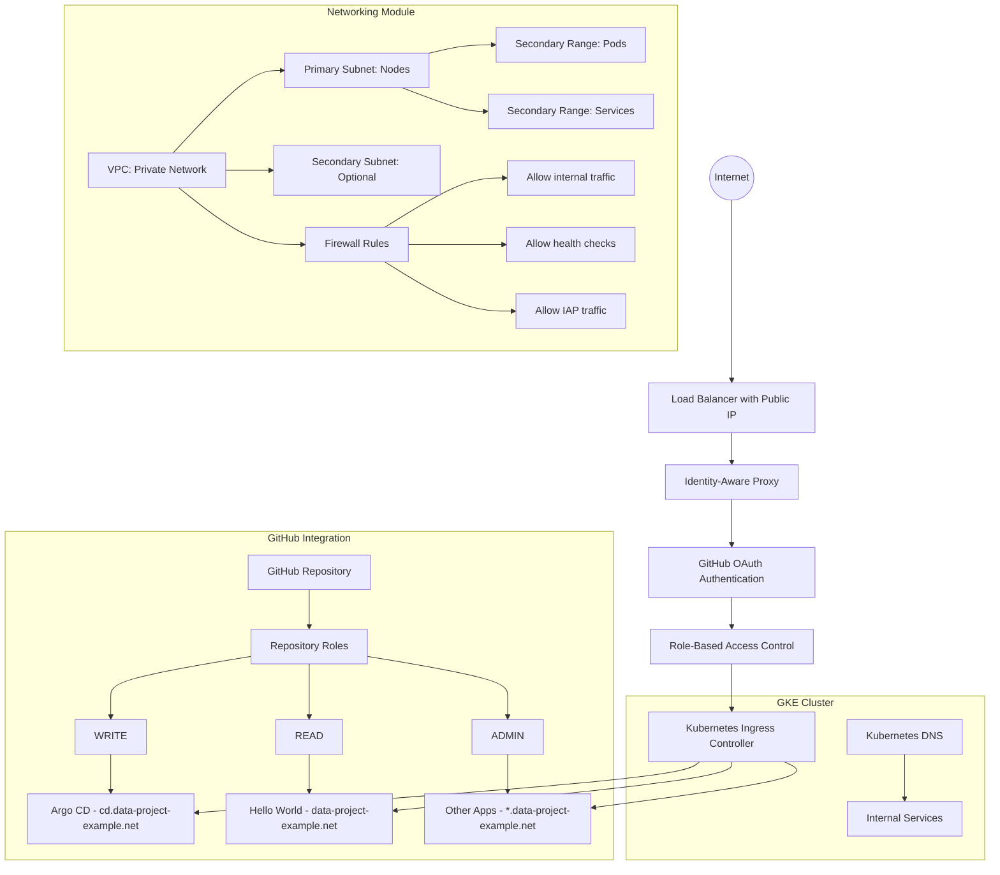

# Networking Module

This module manages GCP networking resources for the data-project-example, including:

- Private VPC for Kubernetes cluster
- Subnets with secondary IP ranges for pods and services
- Static IP addresses for subdomains
- (Optional) DNS records for the static IPs
- Service account with appropriate IAM roles for network administration
- Workload Identity Federation for secure GitHub Actions authentication
- GitHub authentication for Helm-deployed applications and kubectl access
- Integration with Netlify DNS for public domain management

## Purpose

This networking module is part of a personal open-source project released under the MIT License. It's designed to provide a secure and scalable networking infrastructure for Kubernetes applications with GitHub-based authentication, making it easy for individual developers to:

- Deploy applications with proper network isolation
- Authenticate users based on their GitHub repository roles
- Provide secure kubectl access to the cluster
- Manage DNS records for applications

## Architecture

The following diagram shows the enhanced architecture with GitHub authentication:



## Network Resource Classification

This module manages two distinct types of network resources:

### Machine-Only Resources

These resources are used exclusively by the infrastructure and are not directly exposed to users:

- VPC and subnets (internal infrastructure)
- Pod and service IP ranges
- Internal cluster DNS
- Firewall rules for internal communication
- Workload Identity Federation for CI/CD

### User-Facing Resources

These resources are exposed to users and require authentication:

- External static IPs for application access
- IAP configuration for authentication
- Load balancers and ingress controllers
- DNS configuration for public access

## Usage

```hcl
module "networking" {
  source = "./infrastructure/networking"
  
  project = "my-project"
  region  = "us-central1"
  
  # VPC Configuration
  vpc_name = "my-k8s-vpc"
  
  # Subnet Configuration
  subnets = [
    {
      name          = "k8s-subnet"
      ip_cidr_range = "10.0.0.0/20"
      region        = "us-central1"
      secondary_ip_ranges = {
        pods     = "10.16.0.0/12"
        services = "10.32.0.0/16"
      }
    }
  ]
  
  # Static IP Configuration
  subdomains = [
    {
      name = "root",
      address_type = "EXTERNAL",
      network_tier = "PREMIUM"
    },
    {
      name = "cd",
      address_type = "EXTERNAL",
      network_tier = "PREMIUM"
    }
  ]
  
  # GitHub Authentication
  github_oauth = {
    client_id     = "your-github-oauth-client-id"
    client_secret = "your-github-oauth-client-secret"
  }
  
  # GitHub Workload Identity Federation
  project_id_prefix = "myproj"
  github_username = "your-github-username"  # For personal GitHub account
}
```

## Inputs

| Name | Description | Type | Default | Required |
|------|-------------|------|---------|:--------:|
| project | GCP project to deploy resources within | `string` | `"data-project-example"` | no |
| region | GCP region to deploy resources within | `string` | `"us-central1"` | no |
| vpc_name | Name of the VPC to create | `string` | `"k8s-vpc"` | no |
| subnets | List of subnet configurations | `list(object)` | See variables.tf | no |
| subdomains | List of subdomain configurations | `list(object)` | See variables.tf | no |
| project_id_prefix | Prefix for the Workload Identity Pool ID | `string` | `"dataproj"` | no |
| github_username | GitHub username that owns the repository | `string` | `"jolfr"` | no |

## Outputs

| Name | Description | Sensitive | Reason |
|------|-------------|:---------:|--------|
| vpc | The VPC resource details | Yes | Contains network identifiers that could be used in attacks |
| subnet_ids | Map of subnet names to their IDs | Yes | Contains network identifiers that could be used in attacks |
| subnet_self_links | Map of subnet names to their self-links | Yes | Contains network identifiers that could be used in attacks |
| static_ip_details | Map of static IP names to their details | Yes | Contains IP addresses that could be targeted |
| workload_identity_provider | The full resource name of the Workload Identity Provider | Yes | Contains project numbers and authentication details |
| network_service_account_email | The email of the service account | Yes | Could be used for impersonation attacks |
| workload_identity_pool_name | The name of the Workload Identity Pool | Yes | Security through obscurity |
| workload_identity_provider_display_name | The display name of the Workload Identity Provider | Yes | Security through obscurity |
| network_service_account_name | The name of the service account | Yes | Security through obscurity |

## Terraform State Management

This module uses Terraform Cloud for state management. The state is stored in the `data-project-example-networking` workspace within your personal Terraform Cloud account, as configured in `terraform.tf`:

```hcl
terraform {
  cloud {
    organization = "jolfr-personal"

    workspaces {
      name = "data-project-example-networking"
    }
  }
}
```

This ensures:
- Secure storage of state files
- State locking to prevent concurrent modifications
- Version history of infrastructure changes
- Ability to share with collaborators if needed

## GitHub Actions Integration

This module is designed to work with GitHub Actions workflows. The workflows automatically plan and apply Terraform changes when code is pushed to the repository.

### Workflow Structure

1. **Pull Request Workflow** (`pull-request.yml`):
   - Triggered on pull requests to the main branch
   - Runs `terraform plan` to preview changes
   - Comments the plan results on the PR

2. **Main Branch Workflow** (`main.yml`):
   - Triggered on pushes to the main branch
   - Creates a release with changelog
   - Runs `terraform apply` to implement changes

3. **Terraform Module Management** (`terraform.yml`):
   - Detects changes in Terraform files
   - Calls the appropriate plan or apply workflow

### Sensitive Output Handling

Outputs marked as `sensitive = true` are handled securely:

- They are stored in Terraform state but not displayed in logs
- GitHub Actions will show `(sensitive value)` instead of the actual value
- You can retrieve sensitive values manually using `terraform output -json` locally

Example from GitHub Actions logs:
```
Outputs:

network_service_account_email = <sensitive>
subnet_ids = <sensitive>
vpc = <sensitive>
workload_identity_provider = <sensitive>
```

## Bootstrapping Process

### One-Time Setup Steps

1. **Initial Deployment of Networking Infrastructure**:
   ```bash
   # Authenticate with your personal account
   gcloud auth application-default login
   
   # Navigate to the networking module
   cd infrastructure/networking
   
   # Initialize and apply
   terraform init
   terraform apply
   ```

2. **Get the Sensitive Outputs for CI/CD**:
   ```bash
   # Get the Workload Identity Provider name
   PROVIDER=$(terraform output -raw workload_identity_provider)
   
   # Get the Service Account email
   SA_EMAIL=$(terraform output -raw network_service_account_email)
   ```

3. **Add GitHub Repository Secrets for CI/CD**:
   - Go to your GitHub repository → Settings → Secrets and variables → Actions
   - Add the following secrets:
     - `WORKLOAD_IDENTITY_PROVIDER`: The value of `$PROVIDER`
     - `GCP_SERVICE_ACCOUNT`: The value of `$SA_EMAIL`

4. **Set Up GitHub OAuth Application**:
   - Go to your GitHub account → Settings → Developer settings → OAuth Apps
   - Create a new OAuth application with:
     - Application name: `data-project-example`
     - Homepage URL: `https://data-project-example.net`
     - Authorization callback URL: `https://iap.googleapis.com/v1/oauth/clientIds/YOUR_CLIENT_ID:handleRedirect`
   - Note the Client ID and Client Secret

5. **Configure IAP in Google Cloud Console**:
   - Go to Google Cloud Console → Security → Identity-Aware Proxy
   - Enable IAP for the backend services
   - Add members with appropriate roles based on GitHub repository roles

6. **Set Up Internal DNS for the Cluster**:
   - The GKE cluster automatically configures kube-dns or CoreDNS
   - For additional internal DNS zones, create a ConfigMap:
     ```yaml
     apiVersion: v1
     kind: ConfigMap
     metadata:
       name: coredns-custom
       namespace: kube-system
     data:
       internal-services.override: |
         internal.data-project-example.net {
           forward . 10.0.0.10
         }
     ```

7. **Configure Netlify DNS**:
   - Retrieve static IPs from Terraform outputs:
     ```bash
     # Get the static IP for the root domain
     ROOT_IP=$(terraform output -raw static_ip_details | jq -r '.root.ip_address')
     
     # Get the static IP for the cd subdomain
     CD_IP=$(terraform output -raw static_ip_details | jq -r '.cd.ip_address')
     ```
   - Log in to your Netlify account
   - Navigate to the domain settings for `data-project-example.net`
   - Add the following DNS records:
     - A record: `data-project-example.net` → `$ROOT_IP`
     - A record: `cd.data-project-example.net` → `$CD_IP`
     - A record: `*.data-project-example.net` → `$ROOT_IP` (for wildcard subdomains)
     - A record: `*.subdomain.data-project-example.net` → `$ROOT_IP` (for nested wildcard subdomains)

### Per-Application Setup Steps

1. **Create Static IP for the Application** (if needed):
   - Add a new entry to the `subdomains` variable in `variables.tf`:
     ```hcl
     {
       name = "app-name",
       address_type = "EXTERNAL",
       network_tier = "PREMIUM"
     }
     ```
   - Apply the Terraform changes:
     ```bash
     terraform apply
     ```
   - Get the new IP address:
     ```bash
     APP_IP=$(terraform output -raw static_ip_details | jq -r '.app-name.ip_address')
     ```

2. **Configure DNS for the Application**:
   - Add an A record in Netlify DNS:
     - A record: `app-name.data-project-example.net` → `$APP_IP`
   - For nested subdomains:
     - A record: `app-name.subdomain.data-project-example.net` → `$APP_IP`

3. **Configure IAP Access for the Application**:
   - Go to Google Cloud Console → Security → Identity-Aware Proxy
   - Add the new backend service
   - Configure access levels based on GitHub repository roles:
     - READ: Basic access to view the application
     - WRITE: Advanced access to modify application settings
     - ADMIN: Full administrative access

4. **Create Kubernetes Ingress Resource**:
   - Define ingress rules for the application:
     ```yaml
     apiVersion: networking.k8s.io/v1
     kind: Ingress
     metadata:
       name: app-name-ingress
       annotations:
         kubernetes.io/ingress.class: "gce"
         kubernetes.io/ingress.global-static-ip-name: "data-project-example-app-name"
         networking.gke.io/v1beta1.FrontendConfig: "iap-config"
     spec:
       rules:
       - host: "app-name.data-project-example.net"
         http:
           paths:
           - path: "/"
             pathType: Prefix
             backend:
               service:
                 name: app-name-service
                 port:
                   number: 80
     ```

## ArgoCD Integration

ArgoCD is deployed as a special case with the following considerations:

1. **Dedicated Static IP**:
   - ArgoCD has a dedicated static IP at `cd.data-project-example.net`
   - This IP is EXTERNAL to allow user access

2. **GitHub Authentication**:
   - ArgoCD uses GitHub OAuth for authentication
   - Users with WRITE access to the repository can access ArgoCD

3. **RBAC Configuration**:
   - Repository roles are mapped to ArgoCD roles:
     - READ: read-only access to applications
     - WRITE: ability to sync applications
     - ADMIN: full administrative access

4. **Integration with Helm Applications**:
   - ArgoCD manages Helm-deployed applications
   - Applications are defined in the `infrastructure/charts/argo-cd/templates/` directory
   - The hello-world application is accessible at the root domain

## Hello World Application

The hello-world application defined in `infrastructure/charts/argo-cd/templates/hello-world.yaml` is:

1. **Deployed at Root Domain**:
   - Accessible at `data-project-example.net`
   - Requires GitHub READ access to view

2. **Managed by ArgoCD**:
   - Defined as an ArgoCD Application resource
   - Automatically synced from the GitHub repository

3. **Secured with IAP**:
   - Protected by Identity-Aware Proxy
   - Authenticated using GitHub OAuth
   - Access controlled based on repository roles

## Kubectl Access Setup

This section explains how to set up kubectl access to the GKE cluster using GitHub authentication.

### Setting Up Kubectl Access with GitHub Authentication

1. **Install the Google Cloud SDK and kubectl**:
   ```bash
   # Install Google Cloud SDK
   curl https://sdk.cloud.google.com | bash
   
   # Install kubectl
   gcloud components install kubectl
   ```

2. **Install the gke-gcloud-auth-plugin**:
   ```bash
   gcloud components install gke-gcloud-auth-plugin
   ```

3. **Get Cluster Credentials**:
   ```bash
   # Get the cluster credentials
   gcloud container clusters get-credentials data-project-example-cluster \
     --region=us-central1 \
     --project=data-project-example
   ```

4. **Configure IAP for API Server Access**:
   ```bash
   # Enable IAP for the Kubernetes API server
   gcloud compute firewall-rules create allow-iap-to-k8s \
     --direction=INGRESS \
     --action=ALLOW \
     --rules=tcp:443 \
     --source-ranges=35.235.240.0/20 \
     --target-tags=gke-data-project-example-cluster
   ```

5. **Configure kubectl to use IAP Tunnel**:
   ```bash
   # Create an IAP tunnel to the Kubernetes API server
   gcloud compute start-iap-tunnel \
     gke-data-project-example-cluster-master 443 \
     --local-host-port=localhost:8888 \
     --zone=us-central1-a
   
   # Update kubeconfig to use the tunnel
   kubectl config set-cluster data-project-example-cluster \
     --server=https://localhost:8888
   ```

6. **Authenticate with GitHub**:
   - When accessing the cluster through IAP, you'll be prompted to authenticate with GitHub
   - Your GitHub repository role will determine your access level in the cluster

### Access Levels Based on GitHub Repository Roles

1. **READ Access**:
   - Can view resources (pods, services, configmaps, secrets)
   - Cannot modify any resources
   - Ideal for developers who need to monitor but not change resources

2. **WRITE Access**:
   - Can view and modify basic resources (pods, services, configmaps)
   - Cannot modify sensitive resources (secrets, roles, cluster settings)
   - Suitable for developers who need to deploy and manage applications

3. **ADMIN Access**:
   - Full administrative access to all resources
   - Can modify cluster settings, roles, and sensitive resources
   - Reserved for project maintainers

## Security Considerations

1. **No Service Account Keys**: This implementation uses Workload Identity Federation instead of service account keys, eliminating key management risks.

2. **Least Privilege**: The service account has only the necessary networking permissions.

3. **Repository Restriction**: Only the specified GitHub repository can impersonate the service account.

4. **Sensitive Outputs**: All outputs containing potentially sensitive information are marked as sensitive to prevent exposure in logs.

5. **Audit Trail**: All service account impersonation is logged in Cloud Audit Logs.

6. **API Server Access**: Consider restricting the default `api_server_cidr` from `0.0.0.0/0` to your organization's IP ranges.

7. **GitHub Role-Based Access**: Access to applications is controlled based on GitHub repository roles:
   - READ: Basic access to view applications (e.g., hello-world)
   - WRITE: Advanced access to manage applications (e.g., ArgoCD)
   - ADMIN: Full administrative access to all applications

## License

This module is part of the data-project-example, which is released under the MIT License. See the LICENSE file in the repository root for full license text.
