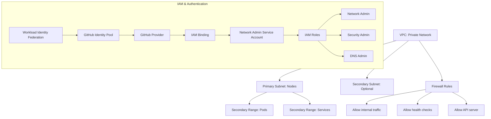

# Plan for Adding Private VPC and Subnet Resources for Kubernetes Cluster

Based on the existing Terraform configuration in the `infrastructure/networking/` directory, I'll create a plan to add resources for a private VPC and subnets specifically designed for a Kubernetes cluster.

## Current State Analysis

The existing networking module is primarily focused on:
- Creating static IP addresses for subdomains
- (Commented out) DNS zone and record creation

## Implementation Plan

I'll add the following components to create a private VPC and subnets for a Kubernetes cluster:

### 1. Update Variables

Add new variables in `variables.tf` for:
- VPC configuration (name, auto-create subnetworks flag, routing mode)
- Subnet configurations (names, CIDR ranges, private Google access, secondary IP ranges for pods and services)
- Firewall rules configuration

### 2. Add VPC Resources

Add to `main.tf`:
- `google_compute_network` resource for the VPC
- Network firewall rules for the Kubernetes cluster

### 3. Add Subnet Resources

Add to `main.tf`:
- `google_compute_subnetwork` resources for the Kubernetes cluster
- Configure secondary IP ranges for Kubernetes pods and services

### 4. Update Outputs

Add to `outputs.tf`:
- VPC details (ID, self_link, name)
- Subnet details (IDs, CIDR ranges, secondary ranges)

### 5. Integration with Existing Resources

Ensure the new VPC and subnet resources work alongside the existing static IP resources.

### 6. Add IAM and Workload Identity Federation

Add a new file `iam.tf` to implement:
- A dedicated service account for network administration
- IAM role bindings for the service account
- Workload Identity Federation pool and provider for GitHub Actions
- IAM bindings to allow GitHub Actions to impersonate the service account

This enables secure authentication from GitHub Actions workflows to GCP without using service account keys.

## Proposed Architecture

## Code Changes

I'll need to modify:
1. `variables.tf` - Add new variables for VPC, subnets, and Workload Identity Federation
2. `main.tf` - Add VPC and subnet resources
3. `outputs.tf` - Add new outputs for VPC, subnets, and Workload Identity Federation
4. `data.tf` - Add data source to get project number
5. Create `iam.tf` - Add service account, IAM roles, and Workload Identity Federation resources

## GitHub Workflow Integration

The Workload Identity Federation setup will integrate with the existing GitHub Actions workflows:
1. The service account and Workload Identity resources will be created as part of the networking module
2. The GitHub Actions workflows will be updated to use Workload Identity Federation for authentication
3. Repository secrets will be added for the Workload Identity provider and service account email

This approach provides secure authentication without service account keys while leveraging the existing CI/CD pipeline structure.
