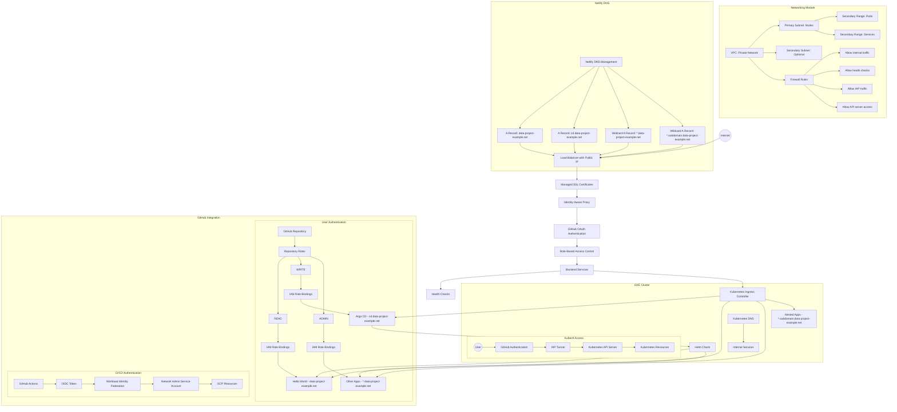

# Plan for Enhancing Networking Module with GitHub Authentication for Helm Applications

Based on the existing Terraform configuration in the `infrastructure/networking/` directory, this plan outlines the enhancements needed to support GitHub authentication for Helm-deployed applications in the GKE cluster.

## Current State Analysis

The existing networking module already includes:
- Private VPC for Kubernetes cluster
- Subnets with secondary IP ranges for pods and services
- Static IP addresses for subdomains (currently configured as INTERNAL by default)
- Firewall rules for Kubernetes cluster
- Workload Identity Federation for GitHub Actions (CI/CD authentication)

## Implementation Plan for GitHub Authentication

To enable GitHub-based authentication for users accessing Helm-deployed applications, we need to implement the following components:

### 1. Network Resource Classification

We need to clearly distinguish between two types of network resources:

**Machine-Only Resources:**
- VPC and subnets (internal infrastructure)
- Pod and service IP ranges
- Internal cluster DNS
- Firewall rules for internal communication
- Workload Identity Federation for CI/CD

**User-Facing Resources:**
- External static IPs for application access
- IAP configuration for authentication
- Load balancers and ingress controllers
- DNS configuration for public access

### 2. DNS Architecture

We'll implement a dual-layer DNS architecture:

**Internal DNS (for cluster services):**
- Kubernetes internal DNS service (kube-dns or CoreDNS)
- Service discovery within the cluster
- Private DNS zone for internal services

**External DNS (for user access):**
- Netlify DNS for public domain management
- Support for multi-level subdomains (*.subdomain.domain-example.net)
- Integration with external IPs and load balancers

### 3. Static IP and External Access Configuration

Update `variables.tf` and `main.tf` to:
- Configure the root domain (`data-project-example.net`) with an EXTERNAL IP for the hello-world application
- Configure the `cd` subdomain (`cd.data-project-example.net`) with an EXTERNAL IP for Argo CD
- Support nested subdomains with pattern `*.subdomain.data-project-example.net`
- Ensure all static IPs are properly tagged for their purpose (user-facing vs. machine-only)

### 4. Identity-Aware Proxy (IAP) Integration

Create a new `iap.tf` file to implement:
- IAP OAuth configuration for GitHub authentication
- Backend service configuration for the Kubernetes ingress
- HTTPS load balancer configuration with SSL certificates

### 5. GitHub OAuth and RBAC Configuration

Create a new `oauth.tf` file to implement:
- GitHub OAuth client registration
- Role mapping between GitHub repository roles and application access
- Custom IAM roles for fine-grained access control

### 6. Firewall Rules Enhancement

Modify firewall rules in `main.tf` to:
- Allow traffic from IAP to the Kubernetes cluster
- Configure health check access for load balancers
- Secure internal communication within the VPC

## Proposed Architecture



## Implementation Steps

### One-Time Setup Steps

1. **Update Networking Module Configuration**:
   - Modify `variables.tf` to support EXTERNAL IPs and GitHub organization authentication
   - Update `main.tf` to create the necessary static IPs
   - Create `iap.tf` and `oauth.tf` for authentication configuration
   - Enhance `iam.tf` with role bindings for GitHub organization teams
   - Add support for team-based access control
   - Configure organization-level permission mappings
   - Add variables for organization settings

2. **Deploy the Updated Networking Module**:
   ```bash
   cd infrastructure/networking
   terraform init
   terraform apply
   ```

3. **Set Up GitHub Organization OAuth Application**:
   - Create a new OAuth application in GitHub organization settings
   - Configure callback URLs for IAP authentication
   - Obtain client ID and secret
   - Configure organization permissions and access
   - Set appropriate permission scopes
   - Consider domain verification for production deployments

4. **Configure IAP with GitHub Authentication**:
   - Set up IAP in Google Cloud Console
   - Configure GitHub as an identity provider
   - Set up access levels based on GitHub repository roles

5. **Configure Netlify DNS**:
   - Retrieve static IPs from Terraform outputs
   - Add A records for root domain and subdomains
   - Add wildcard records for `*.data-project-example.net`
   - Add nested wildcard records for `*.subdomain.data-project-example.net`

6. **Set Up Internal DNS for the Cluster**:
   - Configure CoreDNS or kube-dns in the GKE cluster
   - Set up service discovery for internal applications
   - Create private DNS zone for internal services

7. **Configure Ingress Controller**:
   - Deploy an ingress controller (e.g., NGINX, Istio)
   - Configure TLS termination
   - Set up routing rules for applications

8. **Set Up ArgoCD with GitHub Authentication**:
   - Configure ArgoCD to use GitHub OAuth
   - Set up RBAC based on GitHub repository roles
   - Configure ingress for ArgoCD UI

### Per-Application Setup Steps

1. **Create Static IP for the Application** (if needed):
   - Add a new entry to the `subdomains` variable in `variables.tf`
   - Apply the Terraform changes to create the IP

2. **Configure DNS for the Application**:
   - Retrieve the static IP from Terraform outputs
   - Add an A record in Netlify DNS pointing to the IP
   - For nested subdomains, use the pattern `*.subdomain.data-project-example.net`

3. **Configure IAP Access for the Application**:
   - Add the application to IAP-secured resources
   - Configure access levels based on GitHub repository roles

4. **Create Kubernetes Ingress Resource**:
   - Define ingress rules for the application
   - Configure TLS and backend services
   - Set up path-based or host-based routing

5. **Deploy the Application with Helm**:
   - Create a Helm chart or use an existing one
   - Configure values for GitHub authentication
   - Deploy using ArgoCD or direct Helm commands

## ArgoCD Integration

ArgoCD will be deployed as a special case with the following considerations:

1. **Dedicated Static IP**:
   - ArgoCD will have a dedicated static IP at `cd.data-project-example.net`
   - This IP will be EXTERNAL to allow user access

2. **GitHub Organization Authentication**:
   - ArgoCD will use GitHub OAuth for authentication
   - Team-based access can be configured
   - Organization-wide policies can be applied
   - SSO integration is available for enterprise accounts

3. **RBAC Configuration**:
   - Team roles can be mapped to ArgoCD roles:
     - READ: read-only access to applications (e.g., developer team)
     - WRITE: ability to sync applications (e.g., devops team)
     - ADMIN: full administrative access (e.g., platform team)
   - Custom organization roles can be used for fine-grained access control
   - SAML group mappings can be configured for enterprise GitHub accounts

4. **Integration with Helm Applications**:
   - ArgoCD will manage Helm-deployed applications
   - Applications will be defined in the `infrastructure/charts/argo-cd/templates/` directory
   - The hello-world application will be accessible at the root domain

## Hello World Application

The hello-world application defined in `infrastructure/charts/argo-cd/templates/hello-world.yaml` will be:

1. **Deployed at Root Domain**:
   - Accessible at `data-project-example.net`
   - Requires GitHub organization team membership with READ access

2. **Managed by ArgoCD**:
   - Defined as an ArgoCD Application resource
   - Automatically synced from the GitHub repository
   - Deployment approvals can be configured based on team membership

3. **Secured with IAP**:
   - Protected by Identity-Aware Proxy
   - Authenticated using GitHub organization OAuth
   - Access controlled based on organization team roles
   - SSO integration available for enterprise GitHub accounts

## Code Changes

The following files will need to be modified or created:

1. `variables.tf` - Add variables for GitHub organization OAuth, IAP configuration, and team role mapping
2. `main.tf` - Update static IP configuration to support EXTERNAL IPs
3. `outputs.tf` - Add outputs for GitHub OAuth client ID, IAP settings, and static IP addresses
4. `data.tf` - Add data sources for GitHub organization, teams, and membership information
5. `iam.tf` - Enhance with role bindings for GitHub organization teams
6. New file: `iap.tf` - Implement IAP configuration and backend services
7. New file: `oauth.tf` - Implement GitHub organization OAuth client registration and configuration
8. New file: `teams.tf` - Define mappings between GitHub organization teams and IAM roles

## Netlify DNS Configuration Instructions

After deploying the infrastructure with Terraform, you'll need to configure Netlify DNS with the following steps:

1. **Retrieve Static IP Addresses**:
   ```bash
   # Get the static IP for the root domain
   ROOT_IP=$(terraform output -raw static_ip_details | jq -r '.root.ip_address')
   
   # Get the static IP for the cd subdomain
   CD_IP=$(terraform output -raw static_ip_details | jq -r '.cd.ip_address')
   ```

2. **Configure Netlify DNS Records**:
   - Log in to your Netlify account
   - Navigate to the domain settings for `data-project-example.net`
   - Add the following DNS records:
     - A record: `data-project-example.net` → `$ROOT_IP`
     - A record: `cd.data-project-example.net` → `$CD_IP`
     - A record: `*.data-project-example.net` → `$ROOT_IP` (for wildcard subdomains)
     - A record: `*.subdomain.data-project-example.net` → `$ROOT_IP` (for nested wildcard subdomains)

3. **Verify DNS Configuration**:
   ```bash
   # Check if DNS records are propagated
   dig data-project-example.net
   dig cd.data-project-example.net
   dig random-subdomain.data-project-example.net
   dig random.subdomain.data-project-example.net
   ```

This approach provides a secure, scalable solution for authenticating users to Helm-deployed applications based on their GitHub repository roles, while leveraging the existing infrastructure components and Netlify DNS.
